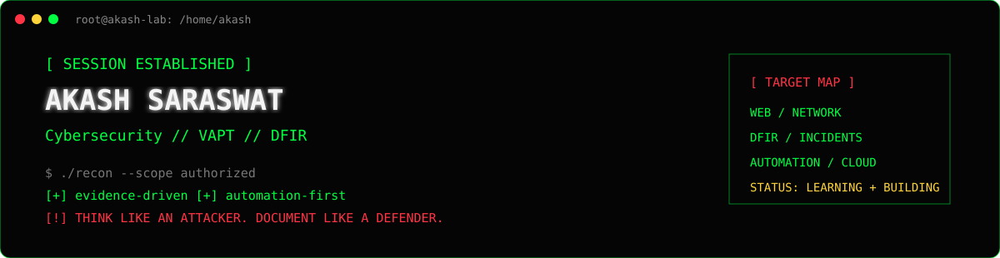

# AKASH SARASWAT

<div align="center">



  
</div>

```bash
┌──(akash㉿security-lab)-[~]
└─$ id
uid=akash(cybersecurity) groups=(vapt,dfir,automation,devsecops)

┌──(akash㉿security-lab)-[~]
└─$ cat /etc/mission
> map the attack surface
> validate findings with evidence
> investigate incidents
> automate repetitive security work
```

## 01 // OPERATOR PROFILE

**Akash Saraswat** — cybersecurity practitioner focused on **Web & Network VAPT, Digital Forensics and Incident Response, and Security Automation**. I like practical labs, repeatable tooling, evidence-driven analysis, and clear remediation.

<p align="center"></p>

## 02 // TOOLKIT

| ATTACK SURFACE | TOOLING / FOCUS |
|:--|:--|
| WEB | Burp Suite · OWASP testing · ZAP |
| NETWORK | Nmap · Wireshark · vulnerability retesting |
| DFIR | Windows event logs · Sysmon · IOC extraction · timelines |
| AUTOMATION | Python · repeatable assessment workflows |
| CLOUD / DEVSECOPS | AWS · Kubernetes · Terraform · monitoring |
| AI SECURITY | LLM security concepts · RAG risks · prompt injection |

## 03 // OPERATIONS LOG

<details open><summary><b>[CASE 001] Digital Forensics & Incident Response</b></summary>

Synthetic Windows ransomware investigation casebook: evidence handling, event analysis, IOC extraction, timeline construction, detection logic, and incident reporting.

**STATUS:** DOCUMENTED · **TYPE:** DFIR CASEBOOK

[OPEN CASE FILE →](https://github.com/akash870547-hue/Digital-Forensics-Incident-Response)
</details>

<details><summary><b>[CASE 002] Web VAPT Suite</b></summary>

Authorized web assessment workflow with methodology, report templates, validation helpers, and a synthetic example report.

[OPEN TOOLKIT →](https://github.com/akash870547-hue/web-vapt-suite)
</details>

<details><summary><b>[CASE 003] Network VAPT Retesting Automation</b></summary>

Compares baseline and retest results, tracking findings as **OPEN / FIXED / CHANGED**.

[OPEN REPOSITORY →](https://github.com/akash870547-hue/Network-vapt-retesting-automation)
</details>

<details><summary><b>[CASE 004] 0x8Acure</b></summary>

Cybersecurity learning platform project with interactive labs, scenarios, quizzes, flags, and security education.

[OPEN REPOSITORY →](https://github.com/akash870547-hue/0x8Acure)
</details>

<details><summary><b>[CASE 005] Multi-Agent SOC Automation</b></summary>

Engineering/research direction exploring multi-agent AI workflows for SOC automation and incident response.

[OPEN REPOSITORY →](https://github.com/akash870547-hue/multi-agent-soc-automation)
</details>

<details><summary><b>[CASE 006] AI DevSecOps Cloud Security</b></summary>

Cloud security and DevSecOps project direction involving CI/CD, AWS EKS, Terraform, Prometheus, Grafana, and monitoring.

[OPEN REPOSITORY →](https://github.com/akash870547-hue/ai-devsecops-cloud-security)
</details>

## 04 // LIVE TELEMETRY

<div align="center">


<br>
</div>

## 05 // ACTIVITY TRACE

<div align="center"></div>

## 06 // RULES OF ENGAGEMENT

```text
[+] SCOPE FIRST       — only test systems with permission
[+] EVIDENCE FIRST    — verify before claiming
[+] CLEAN NOTES       — make findings reproducible
[+] FIX FORWARD       — pair risk with actionable remediation
[+] KEEP LEARNING     — labs, code, research, repeat
```

<div align="center">
<a href="https://www.linkedin.com/in/akash-saraswat-a81a63295/"></a>
<a href="mailto:akash870547@gmail.com"></a>
<br><br>
</div>
