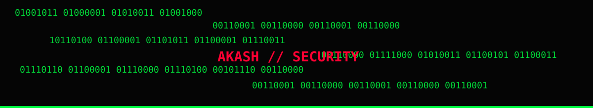

# AKASH SARASWAT

<div align="center">

**CYBERSECURITY • VAPT • DFIR • SECURITY AUTOMATION**


[](https://github.com/akash870547-hue)


</div>



```text
┌─────────────────────────────────────────────────────────────┐
│  ./whoami                                                   │
├─────────────────────────────────────────────────────────────┤
│  name      = Akash Saraswat                                 │
│  role      = Cybersecurity / VAPT / DFIR                    │
│  focus     = Web Security • Network Security • Automation   │
│  lab       = Kali • Ubuntu • Windows • pfSense • Snort      │
│  building  = Security tooling + DevSecOps + AI security    │
│  mission   = Find weaknesses → validate → document → fix    │
└─────────────────────────────────────────────────────────────┘
```

## ./arsenal

<p align="center">
  
</p>

<p align="center">
  
  
  
  
  
  
  
  
</p>

## ./operations

```text
[+] WEB-VAPT             -> Burp Suite / ZAP / OWASP testing
[+] NETWORK SECURITY     -> Nmap / packet analysis / retesting
[+] DIGITAL FORENSICS    -> Windows events / Sysmon / IOC analysis
[+] INCIDENT RESPONSE    -> timelines / evidence handling / reporting
[+] SECURITY AUTOMATION  -> Python tooling / repeatable workflows
[+] DEVSECOPS            -> AWS / Kubernetes / Terraform / monitoring
[+] AI SECURITY          -> LLM security / RAG / prompt-injection concepts
```

## ./featured

### 🧪 Digital Forensics & Incident Response
A structured synthetic Windows ransomware casebook covering evidence handling, event analysis, IOC extraction, timelines, detections, and analyst reporting.

**→** [Digital-Forensics-Incident-Response](https://github.com/akash870547-hue/Digital-Forensics-Incident-Response)

### 🌐 Web VAPT Suite
Authorized web-security assessment workflow with methodology, report templates, validation helpers, and a synthetic example report.

**→** [web-vapt-suite](https://github.com/akash870547-hue/web-vapt-suite)

### 🔁 Network VAPT Retesting Automation
Baseline-vs-retest comparison for tracking findings as **OPEN / FIXED / CHANGED**.

**→** [Network-vapt-retesting-automation](https://github.com/akash870547-hue/Network-vapt-retesting-automation)

### 🛡️ 0x8Acure
DPDP-focused cyber lab platform concept combining interactive learning, scenarios, MCQs, flags, progress, and security education.

**→** [0x8Acure](https://github.com/akash870547-hue/0x8Acure)

### 🤖 Multi-Agent SOC Automation
Research / engineering work around multi-agent AI for SOC automation and incident response.

**→** [multi-agent-soc-automation](https://github.com/akash870547-hue/multi-agent-soc-automation)

### ☁️ AI DevSecOps Cloud Security
Final-year project direction combining secure CI/CD, AWS EKS, Terraform, Prometheus, Grafana, and security monitoring.

**→** [ai-devsecops-cloud-security](https://github.com/akash870547-hue/ai-devsecops-cloud-security)

## ./github

<p align="center">
  
  
</p>

<p align="center">
  
</p>

## ./activity

<p align="center">
  
</p>

## ./protocol

```text
┌───────────────────────────────────────────────────────────────┐
│  OPERATING PRINCIPLES                                         │
├───────────────────────────────────────────────────────────────┤
│  01  Test only with authorization.                            │
│  02  Prefer evidence over assumptions.                        │
│  03  Automate repetitive security work.                       │
│  04  Document findings so they can be reproduced and fixed.   │
│  05  Keep learning through labs, research, and real tooling.  │
└───────────────────────────────────────────────────────────────┘
```

## ./connect

<p align="center">
  <a href="https://www.linkedin.com/in/akash-saraswat-a81a63295/"></a>
  <a href="mailto:akash870547@gmail.com"></a>
  <a href="https://github.com/akash870547-hue"></a>
</p>

<div align="center">
<pre>
> terminal_status
> identity: AKASH_SARASWAT
> objective: BUILD • BREAK • ANALYZE • SECURE
> status: ONLINE
</pre>
</div>


