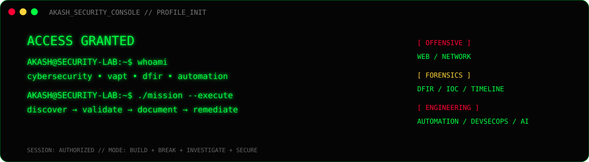

# ⚡ AKASH SARASWAT

> **/dev/security** — I build, break, investigate, and automate security workflows across **Web VAPT, Network Security, DFIR, DevSecOps, and AI Security**.

---

## 🖥️ SECURITY CONSOLE

**Identity:** Akash Saraswat  
**Primary:** VAPT / Offensive Security  
**Secondary:** DFIR / Security Automation  
**Lab:** Kali • Ubuntu • Windows • pfSense • Snort  
**Workflow:** DISCOVER → VALIDATE → DOCUMENT → REMEDIATE  
**Principle:** evidence > assumptions

## 🎯 MISSION CONTROL

| Track | Focus |
|:---|:---|
| 🔴 **Offensive Security** | Web VAPT • OWASP testing • network assessment • retesting |
| 🔵 **DFIR** | Windows artifacts • Sysmon • IOC extraction • timelines |
| 🟢 **Automation** | Python security tooling • repeatable workflows |
| 🟡 **DevSecOps** | AWS • EKS • Terraform • Prometheus • Grafana |
| 🟣 **AI Security** | LLM security • RAG risks • prompt injection |

## 🧰 ARSENAL

---

## 🚀 ACTIVE PROJECTS

### 01 — Digital Forensics & Incident Response
Synthetic Windows ransomware casebook covering evidence handling, Sysmon/event analysis, IOC extraction, timelines, detections, and analyst reporting.

**→** [Open casebook](https://github.com/akash870547-hue/Digital-Forensics-Incident-Response)

### 02 — Web VAPT Suite
Authorized web-security assessment workflow with methodology, reporting templates, validation helpers, and a synthetic target report.

**→** [Open toolkit](https://github.com/akash870547-hue/web-vapt-suite)

### 03 — Network VAPT Retesting Automation
Baseline-vs-retest comparison engine classifying findings as **OPEN / FIXED / CHANGED**.

**→** [Open automation](https://github.com/akash870547-hue/Network-vapt-retesting-automation)

### 04 — 0x8Acure
DPDP-focused cyber learning platform with interactive labs, scenarios, MCQs, flags, XP, progress, and security education.

**→** [Open project](https://github.com/akash870547-hue/0x8Acure)

### 05 — Multi-Agent SOC Automation
Research / engineering work around multi-agent AI for SOC automation and incident response.

**→** [Open project](https://github.com/akash870547-hue/multi-agent-soc-automation)

### 06 — AI DevSecOps Cloud Security
Final-year project direction combining secure CI/CD, AWS EKS, Terraform, Prometheus, Grafana, and cloud security monitoring.

**→** [Open project](https://github.com/akash870547-hue/ai-devsecops-cloud-security)

---

## 📊 TELEMETRY

 

## 📡 ACTIVITY FEED

## 🧬 OPERATING PROTOCOL

01. **AUTHORIZED TESTING** — Never confuse access with permission.  
02. **EVIDENCE FIRST** — Findings should be reproducible, explainable, and defensible.  
03. **AUTOMATE THE BORING** — Repetitive security work belongs in scripts and pipelines.  
04. **BUILD FOR REMEDIATION** — Findings should help someone actually fix the problem.  
05. **KEEP THE LAB ALIVE** — Labs, research, projects, and failures are part of the learning loop.

## 🔐 CONNECT

  

